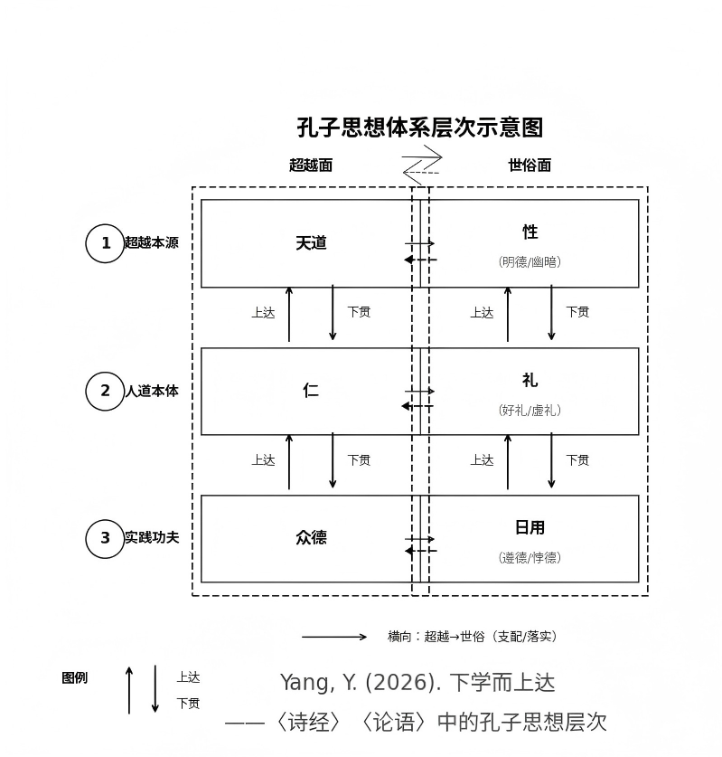

# kuang-di-cheng-sheng

# 匡地成圣
---

> 孔子在何时、何地成为圣人？本文首次提出并论证“匡地成圣”说：约公元前496年，56岁的孔子在匡地被天命拣选，完成了从“人”到“圣”的质变。

本仓库以“匡地成圣”为历史锚点，系统收录核心论文及相关系列研究，重新审视《论语》《诗经》等经典的内在逻辑，试图为理解孔子精神生命提供一个可验证的时空坐标。

---
**主干**：核心论文（匡地成圣）+ 框架文章（下学而上达 + 体系层次图）—— 这两篇是理解整个思想体系的入口，建立了学习《论语》和其他儒家经典的新范式：
> 根据孔子成圣前后分阶段阅读学习《论语》的范式。
> 
> 用孔子的思想层次结构来指导学习儒家经典的路线图。

**分支**：其余所有文章按专题分类放入 `related-studies/` 目录，供深入阅读。

## 📄 核心论文

- **《子畏于匡：孔子“匡地成圣”论——成圣的时空坐标》**（PDF / MD）
  提出“匡地成圣”说的核心论文，系统论证孔子成圣的时空坐标、文本依据与精神机制。

- **《下学而上达——〈诗经〉〈论语〉中的孔子思想层次》**（PDF / MD）
  梳理孔子思想从“下学”到“上达”的层次结构，贯通《诗经》与《论语》，是理解整个思想体系的框架性文章。

- **孔子思想体系层次图**（PNG）
 
  孔子思想体系的视觉化呈现，摘自论文《下学而上达》。

## 📖 建议阅读顺序

1. **核心论文**——《子畏于匡：孔子“匡地成圣”论》，理解作为圣人的孔子，了解根据孔子成圣前后分阶段阅读学习《论语》的范式。
2. **思想框架**——《下学而上达》，理解孔子的思想体系三层结构，用孔子的思想层次结构来指导学习儒家经典，包括《论语》、《诗经》、《尚书》等。
3. **《诗经》专题**——《关雎》《葛覃》《卷耳》及前三篇贯通解读，用“匡地成圣”视角发掘孔子编辑《诗经》的原意。
4. **孔子考证**——理解孔子所处的历史语境
5. **《论语》与经典传承**——理解经典如何被传承与遮蔽
6. **扩展思考**——深入“敬天”与“顺天”的传统智慧

## 📂 相关系列研究（related-studies）

### 《诗经》专题
- 《关雎》——从“斯文在兹”到“圣道传承”
- 以劳定国——诗经·葛覃
- 诗经周南·卷耳解读
- 诗经前三篇贯通解读
- “同志为友”的秘密——郑玄如何在《关雎》笺注中隐藏真相

### 孔子考证
- 孔子父母年龄悬殊说法的由来
- 孔子谓老子犹龙

### 《论语》与经典传承
- 没写出的“圣福音”：子贡与《论语》的成书之迷
- 敬天有本，敬鬼无据

### 扩展思考
- 性自命出与负阴抱阳——人性阴阳流变论
- 顺天久安——双荐治腐

## 📚 关键词

孔子，匡地，成圣，天命，拣选，献祭，子畏于匡，论语，诗经，关雎，葛覃，卷耳，郑玄，子贡，敬天，Confucius，Kuang，sagehood，Analects


## 🔄 版本与更新

本仓库为最新版本，更新最快。PhilArchive 与 Zenodo 为稳定存档版本，便于长期保存与检索。

- **GitHub**（主版本，更新最快）：https://github.com/xgx2000/kuang-di-cheng-sheng
- **PhilArchive**（备份存档）：[搜索论文全名“子畏于匡：孔子‘匡地成圣’论”即可找到](https://philpeople.org/profiles/yuliang-yang)
- **Zenodo**（备份存档）：[同上](https://zenodo.org/search?q=metadata.creators.person_or_org.name%3A%22Yang%2C%20Yuliang%22&l=list&p=1&s=10&sort=bestmatch)

## 💬 联系与交流

如果你读完了其中的任何一篇，有任何想法、疑问、批评、共鸣，或者单纯想打个招呼——我都非常乐意听到你的声音。

同意也好，反对也罢，只要是你认真读过后想说的话，我都欢迎。

学术研究常常是孤独的，但思想的碰撞不应该是。你可以通过以下方式找到我：

- **邮箱**：yangbit@ustb.edu.cn

期待与真正读过这些文字的人交流。

## 📁 仓库结构

以下是本仓库的完整目录结构，方便你快速了解各文件的位置和用途：

```text
kuang-di-cheng-sheng/
├── README.md                             ← 本文件，仓库总说明
│
├── 子畏于匡：孔子“匡地成圣”论V3.7.7.pdf    ← 核心论文（PDF）
├── 子畏于匡：孔子“匡地成圣”论V3.7.7.md     ← 核心论文（Markdown）
│
├── 下学而上达——孔子思想层次（V3.2.3）.md   ← 框架文章：思想体系总览
├── 孔子思想体系层次图-带论文题目-V2.png    ← 框架图：视觉化呈现
│
└── related-studies/                      ← 其他所有系列研究
    ├── 诗经专题/
    ├── 孔子考证/
    ├── 论语与经典传承/
    └── 核心命题与扩展/
```

**主干**：核心论文（匡地成圣）+ 框架文章（下学而上达 + 体系层次图）——这两篇是理解整个思想体系的入口。  
**分支**：其余所有文章按专题分类放入 `related-studies/` 目录，供深入阅读。

## 📜 许可证

本作品采用 CC BY 4.0 许可协议。欢迎引用、分享，请注明出处。
```
