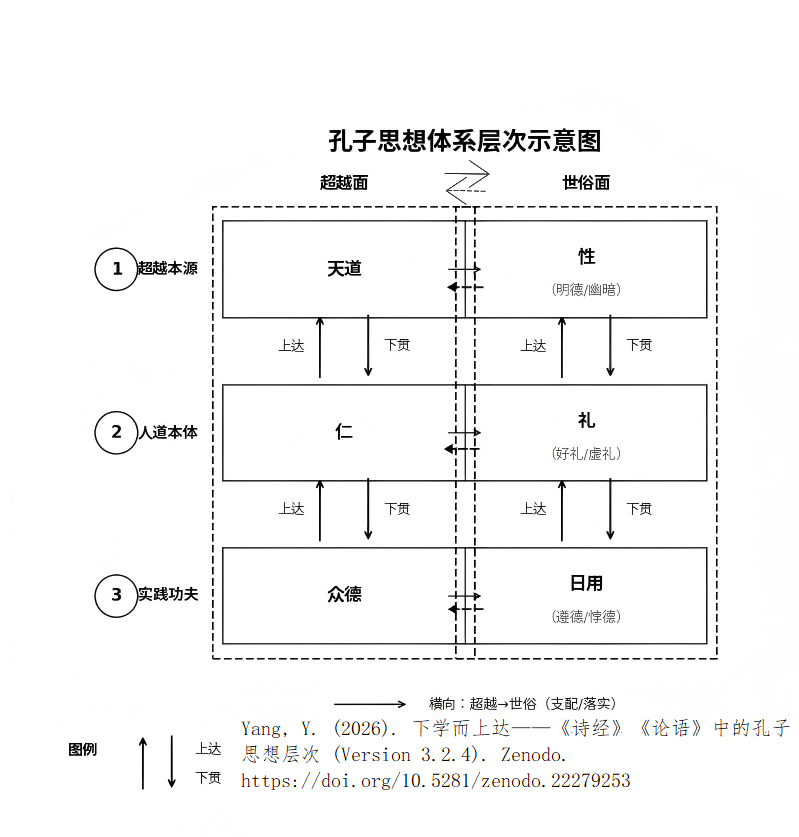

© 2026 杨裕亮.  All works in this repository are licensed under a [Creative Commons Attribution 4.0 International License] (https://creativecommons.org/licenses/by/4.0/)  (CC BY 4.0). 
You are welcome to cite and share, please indicate the source.


# 孔子"匡地成圣"论的提出与论证
---
## 摘要

本仓库系统收录"匡地成圣"说的核心论文与系列研究，提出孔子于公元前496年在匡地完成圣化转变的新学说。研究贯通《论语》《诗经》《尚书》等儒家经典，重新梳理孔子思想层次结构，为理解孔子精神生命提供可验证的时空坐标。核心论文包括《子畏于匡：孔子"匡地成圣"论》《下学而上达》等，涉及先秦哲学、经学诠释、经典传承等议题。

> 孔子在何时、何地成为圣人？本文首次提出并论证“匡地成圣”说：约公元前496年，56岁的孔子在匡地被天命拣选，完成了从“人”到“圣”的质变。

本仓库以“匡地成圣”为历史锚点，系统收录核心论文及相关系列研究，重新审视《论语》《诗经》等经典的内在逻辑，试图为理解孔子精神生命提供一个可验证的时空坐标。

---
**主干**：核心论文（匡地成圣）+ 框架文章（下学而上达 + 体系层次图）—— 这两篇是理解整个思想体系的入口，建立了学习《论语》和其他儒家经典的新范式：
> 根据孔子成圣前后分阶段阅读学习《论语》的范式。
> 
> 用孔子的思想层次结构来指导学习儒家经典的路线图。

**分支**：其余所有文章按专题分类放入 `related-studies/` 目录，供深入阅读。

## 📄 核心论文

- **《子畏于匡：孔子“匡地成圣”论——成圣的时空坐标》**（PDF / MD）
  提出“匡地成圣”说的核心论文，系统论证孔子成圣的时空坐标、文本依据与精神机制。
  DOI 10.5281/zenodo.20578254

- **《下学而上达——〈诗经〉〈论语〉中的孔子思想层次》**（PDF / MD）
  梳理孔子思想从“下学”到“上达”的层次结构，贯通《诗经》与《论语》，是理解整个思想体系的框架性文章。
  DOI 10.5281/zenodo.21856914

- **《颜回孔门地位与华夏道统叙事——基于“匡地成圣”模型的最优自洽重构》**（PDF / MD）
  根据“匡地成圣”论揭示颜回在孔门三千弟子中享有独一无二的神圣地位的原因。本文首次揭示了两千年《论语》研究史上从未被发现的文本结构——《子罕》《先进》两篇之间存在“双重镜像结构”：《子罕》篇记孔子匡地成圣（子畏于匡）+子路使门人为臣（违礼致敬孔子），《先进》篇记颜回见证立约（子畏于匡）+门人厚葬颜回（违礼致敬颜回）。两篇结构完全对称，互为镜像。
  DOI 10.5281/zenodo.22216102

- **图1 孔子思想的三层结构（杨裕亮，2026，基于"匡地成圣"说）**（PNG）
 

孔子思想体系的视觉化呈现，摘自论文《下学而上达》。

学界对孔子思想的层次划分主要有：①"性与天道／仁礼中庸"之两层面说；
②"形上层／价值层／实践层"之三层次说；③"为人求本…为世求安"之四重境界说；
④"志于道、据于德、依于仁、游于艺"之四层次说；⑤仁、礼、政治、教育等多板块罗列。

本文提出的"三层结构"——超越本源（性与天道）—人道本体（仁与礼）—实践功夫
（众德与日用）——区别于既有分法之处在于：它是以下学上达的成圣路径为线索、
并以图形化层次呈现的首个完整体系。

出处：杨裕亮《下学而上达——〈诗经〉〈论语〉中的孔子思想层次》，
Zenodo, 2026，DOI: 10.5281/zenodo.21856914

Figure 1. The Three-Layer Structure of Confucius' Thought (Yuliang Yang, 2026,
based on the "Kuang-di-cheng-sheng" thesis)

Existing hierarchical accounts of Confucius' thought include: (1) the two-level
view ("nature and the Way of Heaven" / "benevolence, ritual and the doctrine
of the mean"); (2) the three-level view (metaphysical / evaluative / practical);
(3) the four-stage "realm" view (seeking foundation in self → principle in action
→ harmony in governance → peace in the world); (4) the four-level schema
"devoted to the Way, grounded in virtue, anchored in benevolence, versed in the arts";
and (5) various multi-category inventories (benevolence, ritual, politics, education, etc.).

The present "three-layer structure" — Transcendent Source (Nature & the Way of Heaven)
→ Humanistic Ontology (Benevolence & Ritual) → Practical Cultivation (the virtues & daily life)
— differs from these earlier accounts in that it follows the "ascending from below to reach above"
(path to sagehood) as its thread, and is the first complete system presented as a graphic hierarchy.

Source: Yuliang Yang, 下学而上达——〈诗经〉〈论语〉中的孔子思想层次 (Version 3.2.0),
Zenodo, 2026, DOI: 10.5281/zenodo.21856914

**<center>表 1：孔子思想的三层结构</center>**
|    层级   |  核心内容 |             基本定位            |
| :-----: | :---: | :-------------------------: |
| **第一层** |  性与天道 |  终极依据（天道为宇宙法则，性为天道在人身上的落实）  |
| **第二层** |  仁与礼  |     枢纽（仁往上黏合天道，往下落实为众德）     |
| **第三层** | 众德与日用 | 实践功夫（忠、恕、孝、悌、勇、信等具体德目与日常行为） |

**第一层 超越本源：性与天道**

“天道”是宇宙的终极法则；“性”是天道在人身上的禀赋。这一层是孔子思想的终极依据，是其道德哲学的本体论根基。

**第二层 人道本体：仁与礼**

这是孔子的核心创见。将仁系统化并确立为人道之本，是孔子的独创。仁是人之为人的核心，礼是仁的外在规范。

这一层是孔子思想的枢纽：往上，仁黏合“性与天道”——仁源于性，性源于天；往下，仁落实为“众德日用”——仁通过具体的德行在生活中展开。

**第三层 实践功夫：众德与日用**

忠、恕、孝、悌、信、勇、智、恭、宽、敏、惠等具体德目，是仁在日用伦常中的具体落实。

这一层是孔子教学中最常被触及的内容，也是《论语》中记载最多的部分。

## 📖 建议阅读顺序

1. **核心论文**——《子畏于匡：孔子“匡地成圣”论》，理解作为圣人的孔子，了解根据孔子成圣前后分阶段阅读学习《论语》的范式。
2. **思想框架**——《下学而上达》，理解孔子的思想体系三层结构，用孔子的思想层次结构来指导学习儒家经典，包括《论语》、《诗经》、《尚书》等。
3. **《诗经》专题**——《关雎》《葛覃》《卷耳》及前三篇贯通解读，用“匡地成圣”视角发掘孔子编辑《诗经》的原意。
4. **孔子考证**——理解孔子所处的历史语境
5. **《论语》与经典传承**——理解经典如何被传承与遮蔽
6. **扩展思考**——深入“敬天”与“顺天”的传统智慧

## 📂 相关系列研究（related-studies）

### 《诗经》专题
- 《<关雎>——从“斯文在兹”到“圣道传承”》, DOI 10.5281/zenodo.20629597
- 《以劳定国:<诗经·葛覃>的政治哲学解读 ——兼论周代贵族女性的社会治理责任与中华文明的价值观根基》, DOI 10.5281/zenodo.20579089
- 《<诗经·周南·卷耳>:匡地成圣与治乱之思——孔子对礼崩乐坏深层根源的诊断》, DOI 10.5281/zenodo.20742216
- 《<诗经>前三篇通解 ——孔子编诗的文明叙事:从"期盼"到"总结"再到"思索"》, DOI 10.5281/zenodo.20759587
- 《“同志为友”的秘密——郑玄如何在《关雎》笺注中隐藏真相》, DOI 10.5281/zenodo.20758054

### 孔子考证
- 《层累与还原:孔子父母"年龄悬殊"说法的由来与早年实态考》, DOI 10.5281/zenodo.21118153
- 《"孔子谓老子犹龙"叙事非孔子本语——基于春秋文本意象、修辞范式与观念史的多维辨伪》, DOI 10.5281/zenodo.21369262

### 《论语》与经典传承
- 《没写出的“圣福音”：子贡与《论语》的成书之迷》, DOI 10.5281/zenodo.21229636
- 《敬天有本,敬鬼无据 ——《论语·雍也》"敬鬼神而远之"文本层位新证》, DOI 10.5281/zenodo.21753422

### 扩展思考
- 《性自命出与负阴抱阳:先秦儒道融通之人性阴阳流变论》，DOI 10.5281/zenodo.20950009
- 《顺天久安,负阴抱阳——基于中华元典智慧的人性阴阳流变百年反腐治本论》, DOI 10.5281/zenodo.20778319

## 📚 关键词

孔子，匡地，成圣，天命，拣选，献祭，子畏于匡，论语，诗经，关雎，葛覃，卷耳，郑玄，子贡，敬天，Confucius，Kuang，sagehood，Analects


## 🔄 版本与更新

本仓库为最新版本，更新最快。PhilArchive 与 Zenodo 为稳定存档版本，便于长期保存与检索。

- **GitHub**（主版本，更新最快）：[搜索‘匡地成圣’论即可找到](https://github.com/kongzi-lab/kuang-di-cheng-sheng)
- **PhilArchive**（备份存档）：[搜索论文全名“子畏于匡：孔子‘匡地成圣’论”即可找到](https://philpeople.org/profiles/yuliang-yang)
- **Zenodo**（备份存档）：[同上](https://zenodo.org/search?q=metadata.creators.person_or_org.name%3A%22Yang%2C%20Yuliang%22&l=list&p=1&s=10&sort=bestmatch)

## 💬 联系与交流

如果你读完了其中的任何一篇，有任何想法、疑问、批评、共鸣，或者单纯想打个招呼——我都非常乐意听到你的声音。

同意也好，反对也罢，只要是你认真读过后想说的话，我都欢迎。

学术研究常常是孤独的，但思想的碰撞不应该是。你可以通过以下方式找到我：

- **邮箱**：yangbit@ustb.edu.cn
- QQ群（匡地成圣）：1048255993，注明想交流的内容。

期待与真正读过这些文字的人交流。

## 📁 仓库结构

以下是本仓库的完整目录结构，方便你快速了解各文件的位置和用途：

```text
kuang-di-cheng-sheng/
├── README.md                             ← 本文件，仓库总说明
│
├── 子畏于匡：孔子“匡地成圣”论.pdf          ← 核心论文（PDF）
├── 子畏于匡：孔子“匡地成圣”论.md           ← 核心论文（Markdown）
│
├── 下学而上达——孔子思想层次.md             ← 框架文章：思想体系总览
├── 孔子思想体系层次图-带论文题目-V2.png    ← 框架图：视觉化呈现
│
├── 颜回孔门地位与华夏道统叙事.pdf          ← 核心论文（PDF）
├── 颜回孔门地位与华夏道统叙事.md           ← 核心论文（Markdown）
|
└── related-studies/                      ← 其他所有系列研究
    ├── 诗经专题/
    ├── 孔子考证/
    ├── 论语与经典传承/
    └── 核心命题与扩展/
```

**主干**：核心论文（匡地成圣）+ 框架文章（下学而上达 + 体系层次图）——这两篇是理解整个思想体系的入口。  
**分支**：其余所有文章按专题分类放入 `related-studies/` 目录，供深入阅读。

## 📜 许可证

本作品采用 CC BY 4.0 许可协议。欢迎引用、分享，请注明出处。
```
